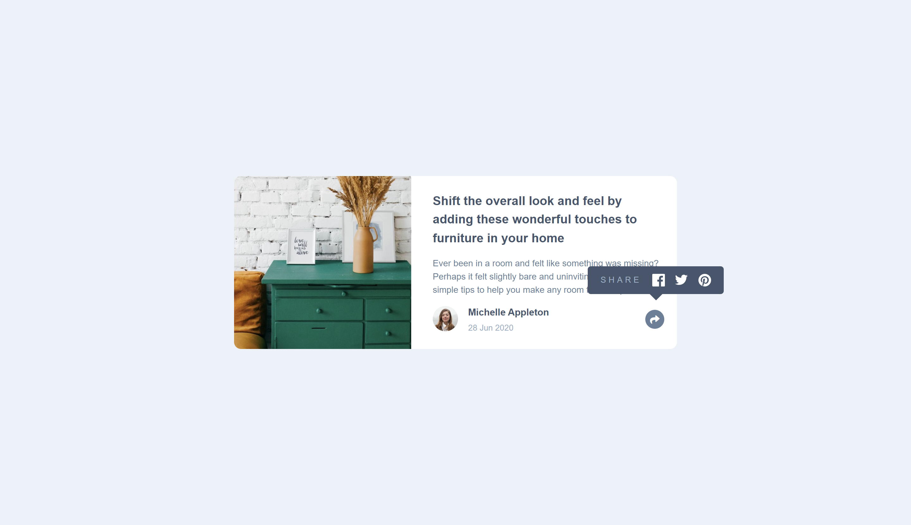
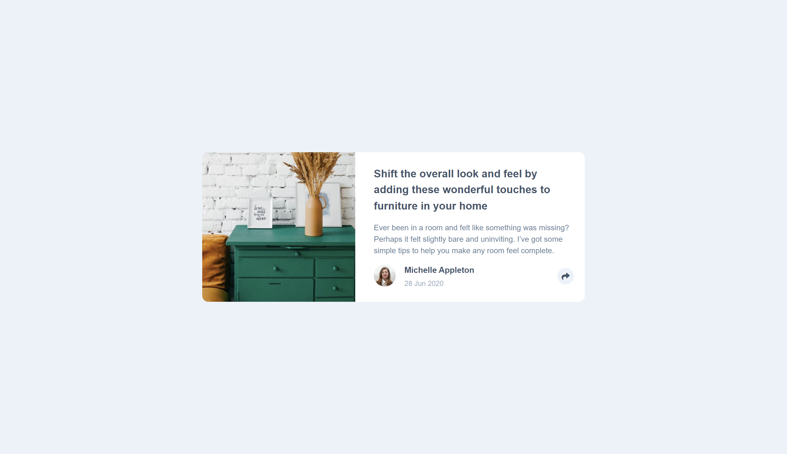
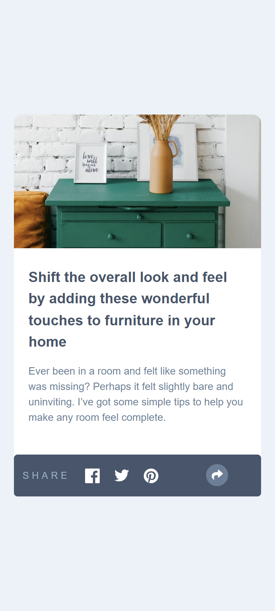
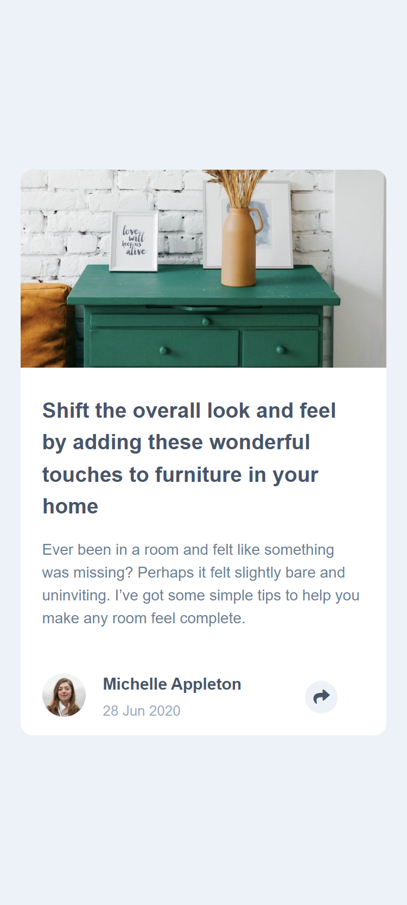

# Article-preview-component

Frontend mentor challenge. I use HTML, CSS, and javaScript.

This is a solution to the [Article preview component challenge on Frontend Mentor](https://www.frontendmentor.io/challenges/article-preview-component-dYBN_pYFT).

## Table of contents

-   [The challenge](#the-challenge)
-   [Screenshot](#screenshot)

### The challenge

Users should be able to:

-   View the optimal layout for the component depending on their device's screen size
-   See the social media share links when they click the share icon

### Screenshot

